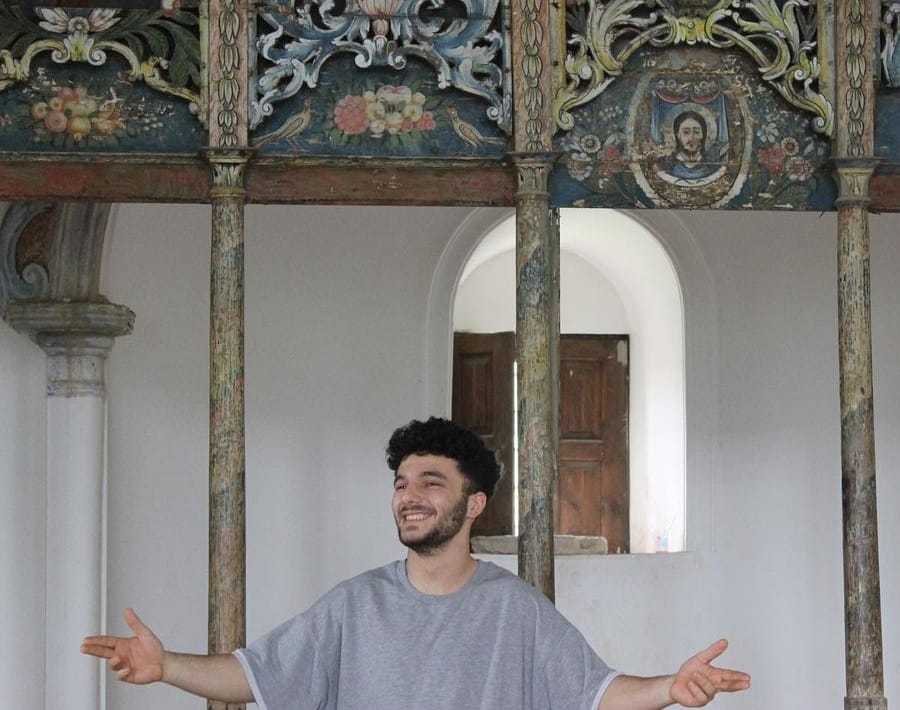

 

<h1 align="center">I am Graphic Designer</h3>

###

 

  

###

## Portfolio

You can view my full <strong>PORTFOLİO</strong> [<strong>here</strong>]((./Talha_Yasin_Gunay_Portfolio.pdf)).

###

 

  
  
  
  
  
  
  
  
  
  
  

###

  

###

  

###

